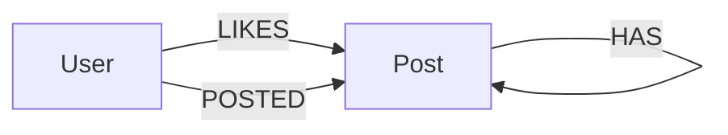

# Social Network Simulator
@ : Louis Schannen, Sebastian Morsch, Bastien Marthe, Benno Weber, Gaëtan Veuillet
## Task 1 – Design

The simulator generates 7 event types: `new-user`, `new-post`, `new-comment`, `like`, `delete-user`, `delete-post`, `update-post`.

**Entities and their data:**
- **User** : `id`, `first`, `last`
- **Post** : `id`, `text`, `date`, `likes` (also used for comments)

**Relationships:**
- A user authors posts and comments via a `Posted` relationship.
- A post can have comments (which are themselves posts) via a `Has` relationship.
- A post accumulates likes (counter only, no user tracking)
- Deleting a user removes all their posts/comments; deleting a post removes it and all its comments recursively
- Deleting a post removes it and all its comments recursively.




---

## Task 2 – Implementation

### Schema

Two node labels, three relationship types are used:

```
(:User {id, first, last})
(:Post {id, text, date, likes})

(:User)-[:POSTED]->(:Post) // user authored a post or comment
(:Post)-[:HAS_COMMENT]->(:Post) // post has a comment
(:User)-[:Like]->(:Post) // user liked a post
```
### Queries for Each Event
`new-user` : 
```
CREATE (u:user {id: <id>, first: "<first>", last: "<last>"})
```

`new-post` : 
```MATCH (n:user {id: <user>})
MERGE (n)-[:Posted]->(p:post {id: <id>, text: "<text>", date: "<date>"})
```

`new-comment` : 
```
MATCH (p:post {id: <post>})
MATCH (u:user {id: <user>})
MERGE (p)-[:Has]->(c:post {id: <id>, text: "<text>", date: "<date>"})<-[:Posted]-(u)
```

`like` : 
```
MATCH (p:post {id: <post>})
MATCH (u:user {id: <user>})
MERGE (u)-[:Like]->(p)
```

`delete-user` : 

```MATCH (u:user {id: <id>})
OPTIONAL MATCH (u)-[:Posted]->(p:post)
OPTIONAL MATCH (p)-[:Has*]->(c:post)
OPTIONAL MATCH (u)-[:Posted]->(cu:post)
DETACH DELETE c, cu, p, u
```

`delete-post` : 

```MATCH (p:post {id: <id>})
OPTIONAL MATCH (p)-[:Has*]->(c:post)
DETACH DELETE c, p
```

`update-post` : 
```
MATCH (p:post {id: <id>})
SET p.text = "<text>"
```
---

## Task 3 – Deployment

### Possible queries labels:
Queries are of two kinds, each with a `Clause` : 
- `Users(clause)` -> count users satisfying `clause`
- `Posts(clause)` -> count posts satisfying `clause`

### Clauses for Users

| Clause | Description |
|---|---|
| `True` | All users |
| `HasFirstName(name)` | Users with that first name |
| `HasLastName(name)` | Users with that last name |
| `HasPost(postClause)` | Users who have authored at least one post satisfying `postClause` |
### Clauses for Posts
| Clause | Description |
|---|---|
| `True` | All posts |
| `HasAuthor(userClause)` | Posts authored by a user satisfying `userClause` |
| `HasComment(postClause)` | Posts that have at least one comment satisfying `postClause` |
| `LikeCount(condition)` | Posts whose number of likes satisfies `condition` |
### Conditions (used with `LikeCount`)
| Condition | Meaning |
|---|---|
| `Exactly(n)` | Like count == n |
| `GreaterThan(n)` | Like count > n |
| `LessThan(n)` | Like count < n |

### Implementation Approach

The `handler` function works by recursively translating the `Query` and `Clause` tree into a query string.

Each clause type is handled by a dedicated function:
- `user_clause_handler` : builds the fragment for user-related clauses
- `post_clause_handler` : builds the fragment for post-related clauses
- `condition_handler` : translates a `Condition` into a `WHERE` predicate

Clauses can be nested so the handlers call each other
recursively, generating chained `MATCH` statements. Each intermediate node gets a unique
variable name (generated with `Namecreator`) to avoid conflicts.

